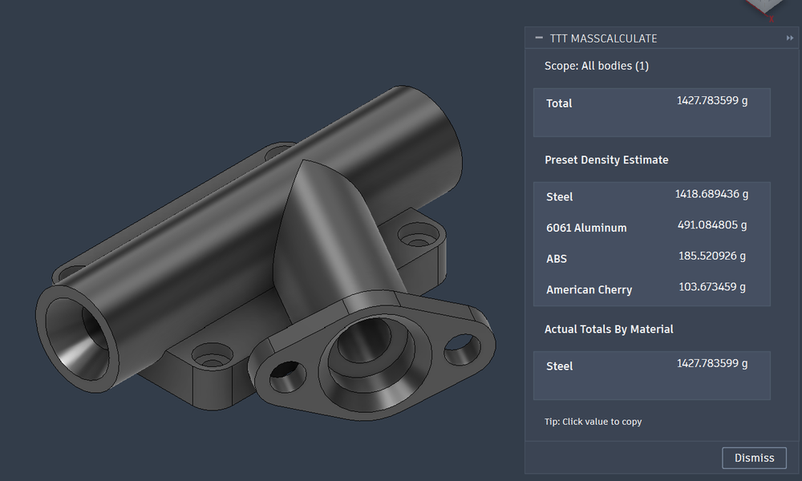
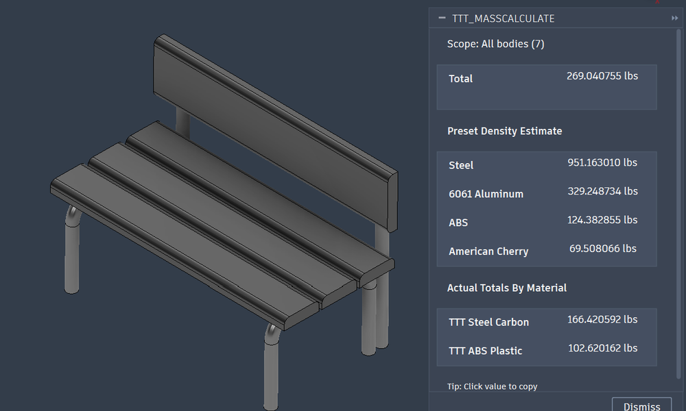
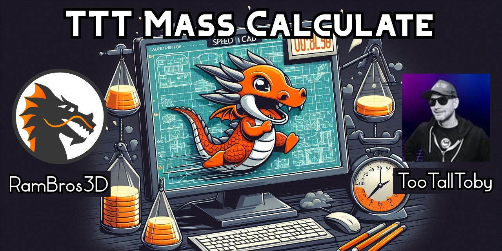

# TTT MassCalculate Ultimate

### The original script was converted into an addon by [@MischaU8](https://github.com/MischaU8/CalculateMass-fusion360)

The addon is functionally identical to the script, but the UI is more intuitive and user friendly.

| Unibody Design | Multimaterial Design |
| :--- | :--- |
|    |  |

### Installation
1. Download & unzip file [TTT_MassCalculate_ADDON.zip](https://github.com/rambros3d/CalculateMass-fusion360/releases/latest/download/TTT_MassCalculate_ADDON.zip).
2. Open Fusion 360 and open **Scripts and Add-Ins**.
3. Click "+" in the **Add-Ins menu**
4. Navigate and select **TTT_MassCalculate** folder
5. Toggle the Addin in the **Run** coloumn.
6. The Addin is acctivated, you can access it from the **Inspect Menu**

Also Recommended: Assign a shortcut key for the Addin.

### TTT Preset Densities
| Material | Density |
| :--- | :--- |
| **Steel** | 7800 kg/m³ |
| **Aluminum** | 2700 kg/m³ |
| **ABS** | 1020 kg/m³ |
| **American Cherry** | 570 kg/m³ |

Note: **American Cherry** was previously known as **Red Oak**

---
## RamBros3D - TTT Calculate Mass

### Dedicated To TooTallToby fans & future Fusion 360 champions

Every year, [TooTallToby & Team](https://www.tootalltoby.com/) host the **WORLD CHAMPIONSHIP OF 3D CAD SPEEDMODELING**.
The 2024 edition was a 16-person 1 vs 1 bracket-style tournament. Checkout TooTallToby's [YouTube channel](https://www.youtube.com/@TooTallToby) for more nail biting tournaments.
Huge kudos to Toby for making CAD a new type of esport; it is fun and enjoyable!

I got to know about TooTallToby from [TeachingTech's Video](https://youtu.be/vGiJLhZ6gIY) in July 2024.

This script was used throughout this tournament:
- [First round](https://youtu.be/5SBDwwzF7B0?t=4938) RamBros vs Ty - September 20, 2024
- [Second round](https://youtu.be/WHVznU5a2hA?t=4873) RamBros vs AceSvaba - October 4, 2024
- [Third round](https://youtu.be/_7c9lpb-9rE?t=6359) RamBros vs Dom - October 18, 2024
- [Final round](https://youtu.be/_7c9lpb-9rE?t=11400) RamBros vs ChrisBCo - October 18, 2024

### How this came into existence

When I was selected for the tournament, I realized that the fusion 360 **properties tool** was taking too much time to calculate all the properties. Since we need only the mass, I figured a script would be much faster.

Initially I used **two different scripts** for calculating mass. The first one would calculate the mass when a body is selected. the second one would calculate the total mass of all bodies in the design. There were no error checks in the in the initial version. There was also no option to calculate mass if it was a multibody part with different material densities.

After winning the championship, I have **unified all the required features** along with the suitable error checks and warnings into one single "ultimate" script.

## The Ultimate Mass Calculate
- **Single Solid Body:** If there is only one solid body in the design, it will display its mass in TTT preset densities (Steel, Aluminum, and ABS).

- **Selected Body Among Multiple:** If you select one solid body (or its face) from a group of several and run the script, it will show the mass of that selected body in TTT preset densities.

- **Total Mass of All Bodies:** If no body is selected and there are multiple solid bodies in the design, the script will provide the total mass of all bodies in TTT preset densities.

- **Multiple body parts:** When multiple bodies are present and at least two have different material densities, the script will display both the total mass in TTT preset densities and also the total mass derived from the actual material properties of the bodies.

### Additional convenience:
- **Automatic unit detection:** the script will automatically detect if the units are metric or imperial.
- **Error Information:** If there are no solid bodies in the design, or if the body is not a solid body, the script will display an info message.

#### License
This script is licensed under the **Public Domain**.

#### Vibe Code Notice
- Code is provided as is; This tool was developed with AI.
- Take it, use it, modify it, feel free to do whatever you wish.